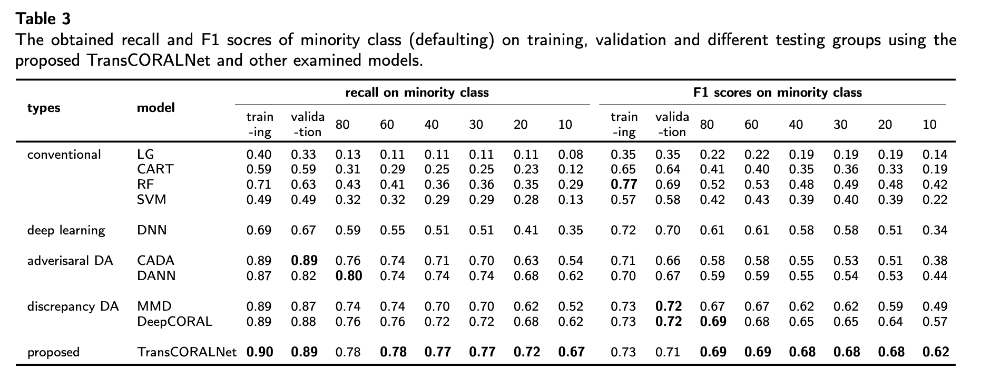

# AA-DeepCORAL
## Architecture
Code for the Paper "TransCORALNet: A Two-Stream Transformer CORAL Networks for Supply Chain Credit Assessment Cold Start" 


The proposed TransCORALNet can be found in the model-folder under: 

**>>>IMPORTANT<<<**

The original Code from the paper can be found in this branch: https://github.com/JieJieNiu/TransCORALNet

Also we provide the code of baseline models MMD and Deep CORAL:https://github.com/JieJieNiu/TransCORALNet/tree/main/MMD and CORAL
CADA and DANN: https://github.com/JieJieNiu/TransCORALNet/tree/main/CADA%20and%20DANN


The trained model canbe download in this branch, you can load model-TransCORALNet.pt and use it directly, also the baseline models of CADA, DANN, MMD and DeepCORAL can be download here: 
https://github.com/JieJieNiu/TransCORALNet/tree/main/Trained%20models

The current master branch has since upgraded packages and was refactored. Since the exact package-versions differ the experiments may not be 100% reproducible.

If you have problems running the code, feel free to open an issue here on Github.

---

## Installing dependencies
In any case a [requirements.txt](requirements.txt) is also added from the poetry export.
```
pip install -r requirements.txt
```

Basically, only the following requirements are needed:
```
numpy==1.20.3
opencv_python_headless==4.6.0.66
pandas==1.3.4
scikit_image==0.18.3
scikit_learn==1.2.0
scipy==1.7.1
torch==1.8.1
torchsummary==1.5.1
torchvision==0.9.1
lime
sdv
```

---

## Usages
### Generate synthetic data
First, use [CTGAN](https://github.com/JieJieNiu/AA-Deep-coral/blob/main/Dataset/CTGAN) to generate synthetic data as target train data. Then use [dataloader](https://github.com/JieJieNiu/AA-Deep-coral/blob/main/Dataset/Dataloader) to prepare the training and testing dataset.


### Training
We offer several training/testing options as below:
For batchsize (--batchsize, default 256)
For training/testing epoch (--epoch, default 250)
TPU allocation 


example
For AA-DeepCORAL training:
```
python AA-DeepCORAL\train and test.py --batchsize 256 --epoch 250 --tpu
```
For AA-DeepCORAL prediction:
```
python AA-DeepCoral/prediction and evaluation.py
```

### Explanation
You can use [Lime](https://github.com/JieJieNiu/AA-Deep-coral/blob/main/Lime) to interpret the results of a model prediction. 
Also, the attention score calculation and visualization can be seen here: [Attention score](https://github.com/JieJieNiu/AA-Deep-coral/blob/main/AA-DeepCoral/Attention score results)


### Plot

Creating similar plots as in the paper: 
Using [rawgraphs](https://www.rawgraphs.io/) to create the following graph:


Using [chiplot](https://www.chiplot.online/) to create the following graph:


### Dataset
The dataset are not open access due to the current data protocal. If you are interested in the dataset that we used in this paper please write an e-mail to: j.shi1@uu.nl and s.mehrkanoon@uu.nl

If you want to run this model on your own datasets, you can either

(1) reorganize your datasets: Step 1.normalized using a [Min-Max normalization](https://en.wikipedia.org/wiki/Feature_scaling#Rescaling_(min-max_normalization)). Step 2. run this code with your data to fit your project https://github.com/JieJieNiu/AA-Deep-coral/Dataset

---


## Results
### Model performance



---
## Citation
```
bibtex
```
